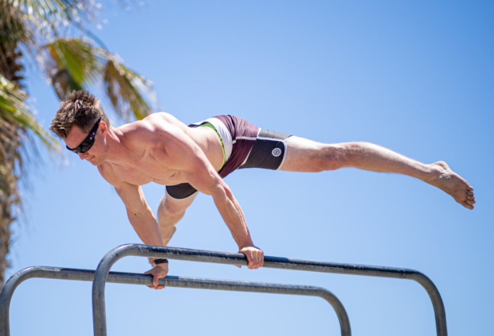

.. _compileLin:

============
Calisthenics
============

What is Calisthenics?
---------------------

Calisthenics is known as bodyweight exercise, or using one’s own bodyweight to build strength and muscle. The exercises require little to no equipment and can be adjusted for any fitness level, and as you work through them you can continuously increase or decrease the difficulty as needed. If done progressively calisthenics can result in extremely impressive power and athleticism. It’s been the main way of exercising and training for millenia, tried and tested so long that one thing is clear: it’s effective.

Calisthenics Routine
--------------------
Calisthenics routines are based around three ideas:

Finding exercises that work your entire body.
Finding a version of the exercise you can do.
Moving on to harder variations as you master easier ones.

Full body exercises may sound scary to beginners, but all it means are exercises that work several muscle groups at once rather than just one. You probably already know more of these than you think. Pushups, leg raises, pullups, and squats are just a few examples of full-body exercises. 

Examples
--------

Let’s take pushups as an example.There’s plenty of variations, they help build upper body and core strength while usually focusing on biceps, pectorals and sometimes triceps, trapezius and core muscles depending on the variation.

A short breakdown, from easier to more difficult variation would like this:

Incline Pushups: 
^^^^^^^^^^^^^^^^

Stand in front of an object anywhere from stomach height to knee height. The taller the object the easier, lower the object the more difficult. Place hands on object about shoulder-width apart. Keep your body in a straight line and keep your head aligned with your body. Perform a pushup and return to the starting position. Repeat.

Full Pushups:
^^^^^^^^^^^^^
Get onto the floor on all fours, hands flat on the ground, back straight and arms about shoulder-width apart. Keep your head facing forward and lower yourself till your chest is  close but not touching the ground. Push back up and return to the starting position.

Archer Pushups: 
^^^^^^^^^^^^^^^

Get into pushup position with arms angled out about 45 degrees. Lower yourself down towards one hand until your shoulder almost touches one hand while your other arm fully extends out in the other direction. Repeat with the alternate side.

.. raw:: html
   

   
There are plenty of variations that are easier, harder and in between these examples, but the idea remains. You take a variation that you can do at whatever fitness level you are and move on to harder variations as soon as you can. Do that with roughly 5 full body exercises and you have a full routine that you can do even if you can’t make it to the gym!

