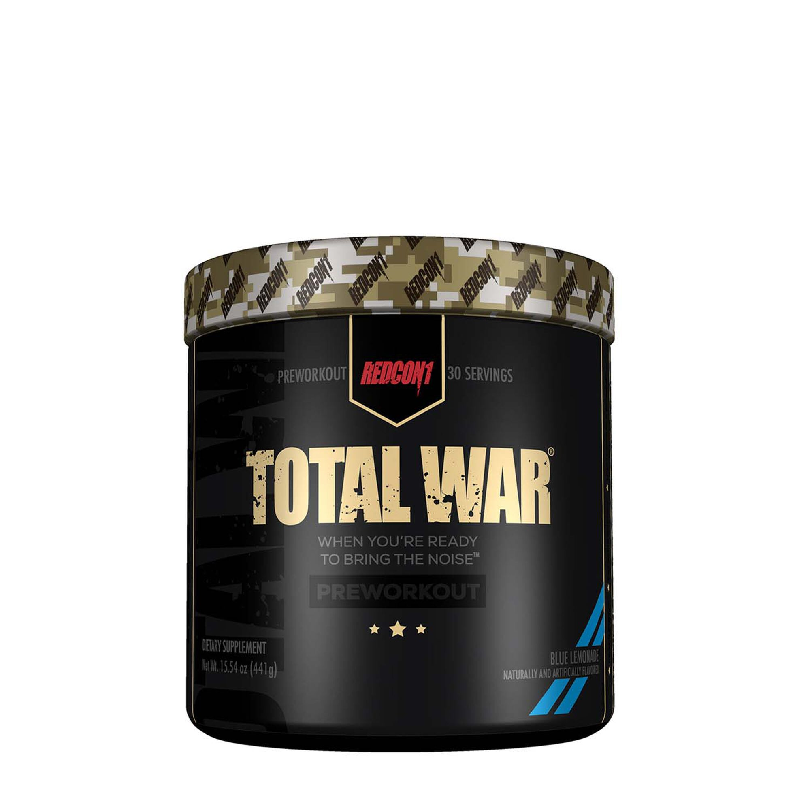

===========
Pre-workout
===========

Why Preworkout
==============

Pre-workouts are supplements that people take before working out in order to maximize their energy and performance during their workout. A lot of people use pre-workout because it gives them more energy so they can workout hard even after a long day of work or school. While this is usually the main reason people, like me, use pre-workouts, there are many other ingredients that help people to perform better during their workouts.

What is in Pre-workout?
=======================

Typically pre-workouts contain some mixture of caffeine, branched-chain amino acids (BCAA), nitrates, creatine, and beta-alanine. While each prework has contains a mixture of these ingredients the dosage of each ingredient is what makes each prework unique and more suitable for some individuals rather than others. 

What is the Purpose of These Ingredients?
=========================================

I will give a quick summary of what each of these ingredients does in order to help people with their workouts. Caffeine is one of the main ingredients of pre-workout and depending on the pre-workout the dosage could range from 150-300mg of caffeine. Caffeine is included in pre-workouts in order to give the consumer more energy. Branched-chain amino acids help with muscle growth because they are important amino acids that help with muscle protein synthesis. Branched-chain amino acids also contain citrulline which helps to improve blood flow to muscles during workouts which helps people get better performance from their muscles. Creatine is found naturally in muscle cells and it helps to increase the energy that your muscles produce during intense workouts. Nitrates help your body to carry more amino acids and other nutrients to your muscles. Lastly beta-alanine helps to eliminate acid accumulation that causes the burning sensation during workouts. This helps people to recover faster and be able to work out for a longer amount of time.

Side Effects of Preworkout
==========================
While pre-workouts can provide many benefits to people it also has health risks if it over consumed and could have negative effects on the body. Because most pre-workouts contain such a high amount of caffeine there is a warning to not take more than one dose per day because that amount of caffeine could have a negative impact on the healthiness of someone’s heart. Also, most clinical studies for pre-workout are conducted over an 8-12 week period shows the effect that pre-workout has on someone’s body. But they conclude after that amount of time so the long-term effects of taking pre-workout are relatively unknown. Not to say that pre-workout is bad for people but it should not be consumed every day because there is very much unknown about the long-term effects it has. A good way to reduce the risk of developing a health problem is to take breaks from taking pre-workout like not using it for a week out of the month.

