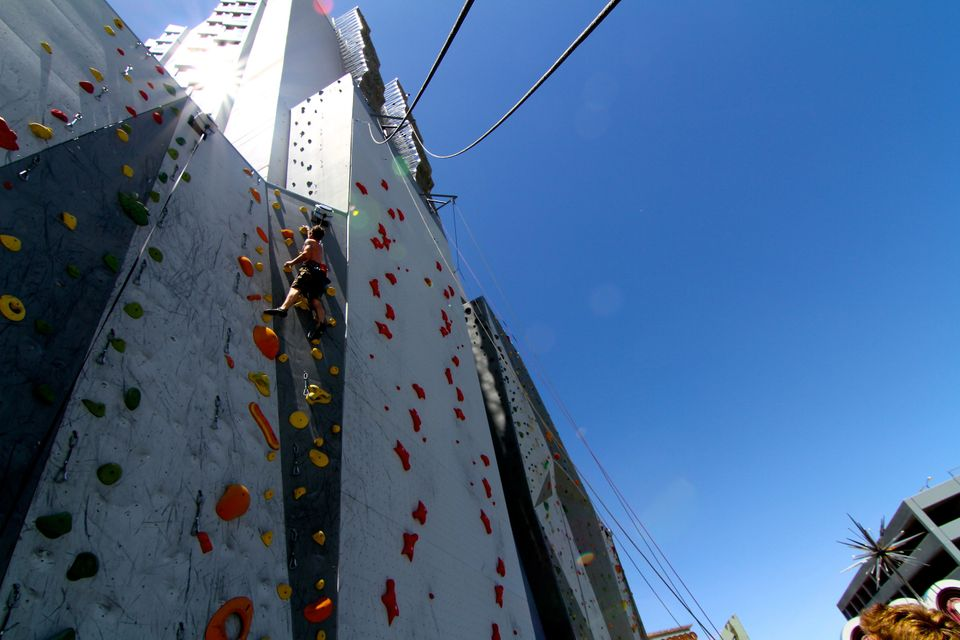

============================================
Rock Climbing - Whitney Peak’s Basecamp Gym
============================================

  
.. raw_html
   
 
   
Why I Began Rock Climbing
=========================

Recently this fall I have taken up at an indoors gym that consists primarily of rock climbing. I had been rock climbing before, but this time I wanted to try to be consistent. The sport has been growing rapidly and I decided I would give it another try. I went to basecamp and bought the month pass with a month of equipment rental also, it was $60 for the month with a student discount. I must say it is a very good workout from my typical gym, it was a lot more cardio and grip strength based than regular gym activities. 

My Progression
==============

The first week I went three days and couldn’t take anymore. My hands were absolutely torn to pieces and I felt sore in places I hadn't felt (particularly in my forearms, and upper-back). The walls offer a very nice work out and are legitimately fun to climb likewise. Indoors at Basecamp there are approximately 9 different walls to climb on, a small gym with at least one machine for each muscle group and rock climbing specific equipment, a sauna, and a washroom. They also have two outdoors walls, but their hours are dependent on the season and time of day. I only used the indoor facilities, but they are all very nice. Their indoor rock climbing walls are the main attraction and each course run offers a different attribute. 

Difficulty of Rock Climbing
===========================

There is a 0 - 9 difficulty rating scale, where the difference is 0 which is a simple climb to the top vs. 9 would be upside down/jumping wall to wall craziness. I was able to get to a 5 difficulty by the end of the month, but I mostly stuck to 2’s and 3’s when I was trying to get in a good workout. When climbing you need the equipment which consists of climbing shoes and a chalk bag, and if you are outside you need your rope, harness, and much more. I was never able to climb outside due to weather, but I did use climbing shoes and a chalk bag. It is imperative to have both of these, I tried to climb without and I just ended up hurting myself. The shoes compact your feet to make it easier and less painful to grab onto small ledges and use them as leverage points, before I rented the equipment I could barely climb the walls. The chalk’s purpose is to make your hands stop blistering, and this was a huge issue I had. Once your hands are blistered, it is hard to climb or even move your hands due to the pain and stiffness. I learned quickly that there was no such thing as too much chalk, the only bad thing about using all the chalk is that it gets all over your clothes! 

Preference of My Climbs at Basecamp
===================================

I would go primarily at nighttime after 7:45, in my own experience it is way too busy before this point to be enjoyable. Too many people and they host classes for children, so it can be chaotic if you go during peak hours. Overall, I would say the experience was very helpful and enjoyable. Next time I want to buy shoes beforehand to make it so I have no need for the monthly equipment rental. I would also like to figure out when the least busy times are so I can have all the walls to myself. 

